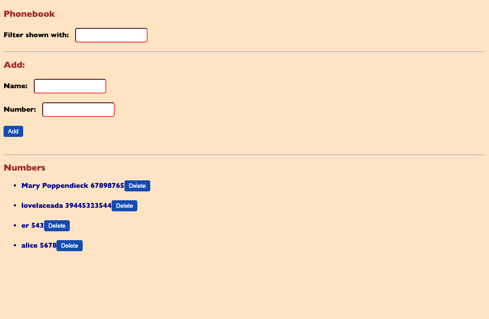

# Phonebook

A React phonebook: add people with their number, filter the list, delete entries, and replace the number of someone who is already in the list. Success and error messages are shown after each action.

Built as an exercise from the [Full Stack Open](https://fullstackopen.com/) course (part 2).



## How it works

- Data is stored in [`db.json`](db.json) and served by JSON Server on port 3001.
- All requests go through one service module, [`src/services/persons.js`](src/services/persons.js).
- UI parts are split into components in [`src/components/`](src/components): `Filter`, `PersonForm`, `Persons` and `Notification`.

## Built with

- React (`useState`, `useEffect`)
- Axios
- JSON Server
- Vite

## Run locally

Start the backend and the app in two terminals:

```bash
npm install
npm run server   # JSON Server on http://localhost:3001
```

```bash
npm run dev
```
